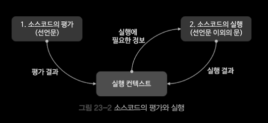
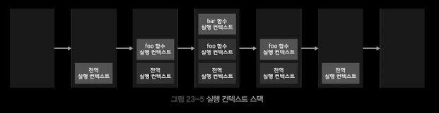
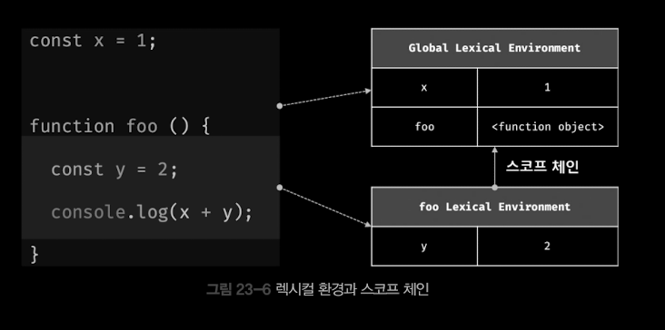
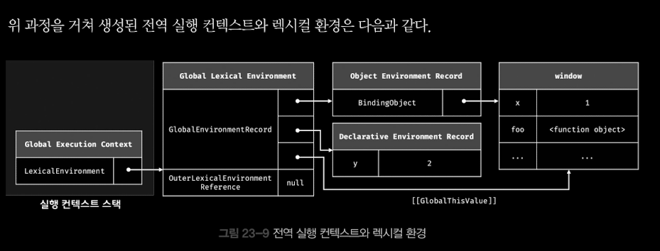

# Ch.23 실행 컨텍스트

- 실행 컨텍스트 execution context 는 자바스크립트의 동작 원리를 담고 있는 핵심 개념이다.

## 23.1 소스코드의 타입

| 소스코드의 타입         | 설명                                                                                                         |
| ----------------------- | ------------------------------------------------------------------------------------------------------------ |
| 전역 코드 global code   | 전역에 존재하는 소스코드를 말한다. 전역에 정의된 함수, 클래스 등의 내부 코드는 포함 되지않는다.              |
| 함수 코드 function code | 함수 내부에 존재 내부에 존재하는 소스코드, 함수 내부에 중첩된 함수, 클래스 등의 내부 코드는 포함되지 않는다. |
| eval 코드 eval code     | 빌트인 전역 함수인 eval 함수에 인수로 전달되어 실행되는 소스코드                                             |
| 모듈 코드 module code   | 모듈 내부에 존재하는 소스코드. 모듈 내부의 함수, 클래스 등의 내부 코드는 포함되지 않는다.                    |

1. 전역 코드

- 전역 변수를 관리하기 위해 최상위 스코프인 전역 스코프를 생성해야 한다. 그리고 var 키워드로 선언된 전역 변수와 함수 선언문으로 정의된 전역 함수를 전역 객체의 프로퍼티와 메서드로 바인딩하고 참조하기 위해 전역 객체와 연결되어야 한다. 이를 위해 전역 코드가 평가되면 전역 실행 컨텍스트가 생성된다.

2. 함수 코드

- 함수 코드는 지역 스코프를 생성하고 지역 변수, 매개변수, argument 객체를 관리해야 한다. 그리고 생성한 지역 스코프를 전역 스코프에서 시작하는 스포크 체인의 일원으로 연결해야 한다. 이를 위해 함수 코드가 평가되면 함수 실행 컨텍스트가 생성된다.

3. eval 코드

- eval 코드는 strict mode 에서 자신만의 독자적인 스코프를 생성한다. 이를 위해 eval 코드가 평가되면 eval 실행 컨텍스트가 생성된다.

4. 모듈 코드

- 모듈 코드는 모듈별로 독립적인 모듈 스코프를 생성한다. 이를 위해 모듈 코드가 평가되면 모듈 실행 컨텍스트가 생성된다.

## 23.2 소스코드의 평가와 실행

- 자바스크립트 엔진은 소스코드를 2개의 과정으로 나누어 처리한다.

1. 소스코드의 평가 : 실행 컨텍스트를 생성하고 변수, 함수 등의 선언문만 먼저 실행하여 생성된 변수나 함수 식별자를 키로 실행 컨텍스트 관리하는 스코프(렉시컬 환경의 환경 레코드)에 등록 한다.
2. 소스코드의 실행 : (런타임) 소스코드 실행에 필요한 정보, 즉 변수나 함수의 참조를 실행 컨텍스트가 관리하는 스포크에서 검색해서 취득한다. 그리고 변수 값의 변경 등 소스코드의 실행 결과는 다시 실행 컨텍스트가 관리하는 스코프에 등록 된다.
   

## 23.3 실행 컨텍스트의 역할

```jsx
// 전역 변수 선언
const x = 1;
const y = 2;
// 함수 정의
function foo(a) {
	// 지역 변수 선언
	const x = 10;
	const y = 20;
	// 메서드 호출
	console.log(a + x + y); // 130
}

// 함수 호출
foo(100);

// 메서드 호출
console.log(x + y); // 3
```

<실행 콘테스트는 소스코드를 실행하는 데 필요한 환경을 제공하고 코드의 실행 결과를 실제로 관리하는 영역이다. >

1. 전역 코드 평가
2. 전역 코드 실행
3. 함수 코드 평가
4. 함수 코드 실행

- 코드가 실행되려면 다음과 같이 스코프, 식별자, 코드 실행 순서 등의 관리가 필요하다.

1. 선언에 의해 생성된 모든 식별자(변수, 함수, 클래스 등)를 구분하여 등록하여 상태 변화(식별자에 바인딩된 값의 변화)를 지속적으로 관리할 수 있어야 한다.
2. 스코프는 중첩 관계에 의해 스코프 체인을 형성해야 한다. 즉, 스코프 체인을 통해 상위 스코프로 이동하며 식별자를 검색할 수 있어야 한다.
3. 현재 실행 중인 코드의 실행 순서를 변경(예를 들어, 함수 호출에 의한 실행 순서 변경) 할 수 있어야 하며 다시 되돌아갈 수도 있어야 한다.

- 실행 컨텍스트는 식별자(변수, 함수, 클래 등의 이름)을 등록하고 관리하는 스코프와 코드 실행 순서 관리를 구현한 내부 매커니즘으로 모든 코드는 실행 컨텍스트를 통해 실행되고 관리된다.

## 23.4 실행 컨텍스트 스택

```jsx
const x = 1;
function foo() {
	const y = 2;
	function bar() {
		const z = 3;
		console.log(x + y + z);
	}
	bar();
}
foo(); // 6
```



- 생성된 실행 컨텍스트들은 스택 stack 자료구조로 관리한다. 이를 실행 컨텍스트 스택이라고 부른다.

1. 전역 코드의 평가와 실행
2. foo 함수 코드의 평가와 실행
3. bar 함수 코드의 평가와 실행
4. foo 함수 코드로 복귀
5. 전역 코드로 복귀

- 이처럼 실행 컨텍스트 스택은 코드의 실행 순서를 관리한다.
- 실행 컨텍스트 스택의 최상위에 존재하는 실행 컨텍스트는 언제나 현재 실행 중인 코드의 실행 컨텍스트다. = 실행 중인 실행 컨텍스트 running execution context

## 23.5 렉시컬 환경 Lexical Environment

- 렉시컬 환경은 식별자와 식별자에 바인딩된 값, 그리고 상위 스코프에 대한 참조를 기록하는 자료구조로 실행 컨텍스트를 구성하는 컴포넌트다. 실행 컨텍스트 스택이 코드의 실행 순서를 관리한다면 렉시컬 환경은 스코프와 식별자를 관리한다.
  

##### 환경 레코드 Environment Record : 스코프에 식별자를 등록하고 등록된 식별자에 바인딩된 값을 관리하는 저장소다. 환경 레코드는 소스코드의 타입에 따라 관리하는 내용에 차이가 있다.

##### 외부 렉시컬 환경에 대한 참조 Outer Lexical Environment Reference : 외부 렉시컬 환경에 대한 참조는 상위 스코프를 가리킨다. 이때 상위 스코프란 외부 렉시컬 환경, 즉 해당 실행 컨텍스트를 생성한 소스코드를 포함하는 상위 코드의 렉시컬 환경을 말한다. 외부 렉시컬 환경에 대한 참조를 통해 단방향 링크드 리스트인 스코프 체인을 구성한다.

## 23.6 실행 컨텍스트의 생성과 식별자 검색 과정

### 23.6.1 전역 객체 생성

- 전역 객체는 전역 코드가 평가되기 이전에 생성된다.
- 빌트인 전역 프로퍼티와 빌트인 전역 함수, 그리고 표준 빌트인 객체 추가
- 동작 환경 또는 특정 환경을 위한 호스트 객체를 포함
- Object.prototype을 상속 받는다. 즉, 전역 객체도 프로토타입의 일원이다.

### 23.6.2 전역 코드 평가



1. 전역 실행 컨텍스트 생성
2. 전역 렉시컬 환경 생성
   2.1 전역 환경 레코드 생성
   2.1.1 객체 환경 레코드 생성
   2.1.2 선언적 환경 레코드 생성
   2.2 this 바인딩
   2.3 외부 렉시컬 환경에 대한 참조 결정
