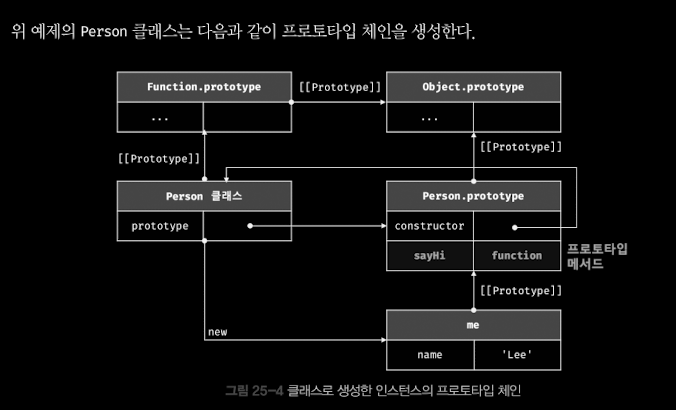

# Ch.25 클래스

## 25.1 클래스는 프로토타입의 문법적 설탕인가?

### _문법적 설탕보다는 새로운 객체 생성 메커니즘이다._

---

- ES6 에서 도입된 클래스는 기존 프로토타입 기반 객체지향 프로그래밍보다 자바나 C# 같은 클래스 기반 객체 지향 프로그래밍에 익숙한 프로그래머가 더욱 빠르게 학습할 수 있도록 클래스 기반 객체지향 프로그래밍 언어와 매우 흡사한 새로운 객체 생성 메커니즘을 제시한다.
- 자바스크립트에서 클래스는 단순히 함수이며 기존 프로토타입 기반 패턴을 클래스 기반 패턴처럼 사용할 수 있도록 하는 문법적 설탕이라고 볼 수 있다.

- 클래스와 생성자 함수와 차이

  1. 클래스를 new 연산자 없이 호출하면 에러가 발생한다.
  2. 클래스는 상속을 지원하는 extends와 super 키워드를 제공한다.
  3. 클래스는 호이스팅이 발생하지 않는 것처럼 동작한다.
  4. 클래스 내의 모든 코드에는 암묵적으로 strict mode가 지정되어 실행되며 해제할 수 없다.
  5. 클래스의 constructor, 프로토타입 메서드, 정적 메서드는 모두 프로퍼티 어트리뷰트 [[Enumerable]]의 값이 false다.

- 클래스는 생성자 함수 기반의 객체 생성 방식보다 견고하고 명료하다.
- 새로운 객체 생성 메커니즘으로 보는 것이 좀 더 합당하다.

## 25.2 클래스 정의

- 클래스는 class 키워드를 사용하여 정의한다.

```jsx
// 익명 클래스 표현식
const Person = class {};

// 기명 클래스 표현식
const Person = class MyClass {};
```

- 무명의 리터럴로 생성할 수 있다. 즉 런타임에 생성이 가능하다.
- 변수나 자료구조(객체, 배열 등)에 저장할 수 있다.
- 함수의 매개변수에게 전달할 수 있다.
- 함수의 반환값으로 사용할 수 있다.

- 클래스는 함수다. 따라서 클래스는 값처럼 사용할 수 있는 일급 객체다.

```jsx
// 클래스 선언문
class Person {
	// 생성자
	constructor(name) {
		// 인스턴스 생성 및 초기화
		this.name = name;
	}
	// 프로토타입 메서드
	sayHi() {
		console.log(`Hi! My Name is ${this.name}`);
	}
	// 정적 메서드
	static sayHello() {
		console.log("hello");
	}
}
// 인스턴스 생성
const me = new Person("Han");

// 인스턴스의 프로퍼티 참조
console.log(me.name); // Han

// 프로토타입 메서드 호출
me.sayHi(); // Hi! My name is Han

// 정적 메서드 호출
Person.sayHello(); // Hello
```

## 25.3 클래스 호이스팅

```jsx
class Person {}

console.log(typeof Person);
```

- 클래스 선언문으로 정의한 클래스는 함수 선언문과 같이 소스 코드 평가 과정, 즉 런타임 이전에 먼저 평가되어 함수 객체를 생성한다.
- 이때 클래스가 평가되어 생성된 함수 객체는 생성자 함수로서 호출할 수 있는 함수, 즉 constructor다.
- 생성자 함수로서 호출할 수 있는 함수는 함수 정의가 평가되어 함수 객체를 생성하는 시점에 프로토타입도 더불어 생성된다.
- 프로토타입과 생성자 함수는 단독으로 존재할 수 없고 언제나 쌍으로 존재하기 때문이다.
- 단 클래스는 정의 이전에 참조할 수 없다.

## 25.4 인스턴스 생성

- 클래스는 생성자 함수이며 new 연산자와 함께 호출되어 인스턴스를 생성한다.

```jsx
class Person {}

conse me = new Person();
console.log(me);
```

- 클래스 표현식으로 정의된 클래스의 경우 다음 예제와 같이 클래스를 가리키는 식별자를 사용해 인스턴스를 생성하지 않고 기면 클래스 표현식의 클래스 이름을 사용해 인스턴스를 생성하면 에러가 발생한다.

## 25.5 메서드

- 클래스 몸체에는 0개 이상의 메서드만 선언할 수 있다.
- 클래스 몸체에서 정의할 수 있는 메서드는 constructor(생성자), 프로토타입 메서드, 정적 메서드의 세 가지가 있다.

## 25.5.1 constructor

- constructor 는 인스턴스를 성상하고 초기화하기 위한 특수한 메서드가. constructor는 이름을 변경할 수 없다.

```jsx
class Person {
	// 생성자
	constructor(name) {
		// 인스턴스 생성 및 초기화
		this.name = name;
	}
}
```

- constructor는 메서드로 해석되는 것이 아니라 클래스가 평가되어 생성한 함수 객체 코드의 일부가 된다.
- constructor 는 클래스 내에 최대 한 개만 존재할 수 있다.

- 프로퍼티가 추가되어 초기화된 인스턴스를 생성하려면 constructor 내부에서 this 인스턴스 프로퍼티를 추가한다.

```jsx
class Person {
	constructor() {
		// 고정값으로 인스턴스 초기화
		this.name = "Han";
		this.address = "Seoul";
	}
}

const me = new Person();
console.log(me); // Person {name:"Han", address:"Seoul"}
```

- 인스턴스를 생성할 때 클래스 외부에서 인스턴스 프로퍼티의 초기값을 전달하려면 다음과 같이 constructor에 매개변수를 선언하고 인스턴스를 생성할 때 초기값을 전달한다.
- 이때 초기값은 constructor의 매개변수에게 전달된다.

```jsx
class Person {
	constructor(name, address) {
		// 인수로 인스턴스 초기화
		this.name = name;
		this.address = address;
	}
}

// 인수로 초기값을 전달한다. 초기값은 constructor에 전달된다.

const me = new Person("Han", "Seoul");
console.log(me); // Person {name:"Han", address:"Seoul"}
```

- 이처럼 constructor 내에서는 인스턴스의 생성과 동시에 인스턴스 프로퍼티 추가를 통해 인스턴스의 초기화를 실행한다.
- 따라서 인스턴스를 초기화하려면 constructor를 생략해서는 안된다.

- constructor는 별도의 반환문을 갖지 않아야 한다. 이는 new 연산자와 함께 클래스가 호출되면 생성자 함수가 동일하게 암묵적으로 this, 즉 인스턴스를 반환하기 때문이다.
- 만약 this가 아닌 다른 객체를 명시적으로 반환하면 this, 즉 인스턴스가 반환되지 못하고 return 문에 명한 객체가 반환된다.

```jsx
class Person {
	constructor(name) {
		this.name = name;
		// 명시적으로 객체를 반환하면 암묵적인 this 반환이 무시된다.
		return {};
	}
}
// constructor에서 명시적으로 반환한 빈 객체가 반환된다.
const me = new Person("Han");
console.log(me); // {}
```

- 이처럼 constructor 내부에서 명시적으로 this가 아닌 다른 값을 반환하는 것은 클래스의 기본 동작을 훼손한다.
- 따라서 constructor 내부에서 return 문을 반드시 생략해야 한다.

## 25.5.2 프로토타입 메서드

- 생성자 함수를 사용하여 인스턴스를 생성하는 경우 프로토타입 메서드를 생성하기 위해서는 다음과 같이 명시적으로 프로토타입에 메서드를 추가해야 한다.

```jsx
//생성자함수의 경우
function Person(name) {
	this.name = name;
}
Person.prototype.sayHi = function () {
	console.log(`Hi! My name is ${this.name}`);
};
const me = new Person("Han");
me.sayHi(); // Hi! My name is Han
```

- 클래스 몸체에서 정의된 메서드는 생성자 함수에 의한 객체 생성 방식과는 다르게 클래스의 prototype 프로퍼티에 메서드를 추가하지 않아도 기본적으로 프로토타입 메서드가 된다.

```jsx
// 클래스의 경우
class Person {
	// 생성자
	constructor(name) {
		// 인스턴스 생성 및 초기화
		this.name = name;
	}
	// 프로토타입 메서드
	sayHi() {
		console.log(`Hi My Name is ${this.name}`);
	}
}

const me = new Person("Han");
me.sayHi(); // Hi! My name is Han
```

- 생성자 함수와 마찬가지로 클래스가 생성한 인스턴스는 프로토타입 체인의 일원이 된다.

```jsx
// me 객체의 프로토타입은 Person.prototype 이다.
Object.getPrototypeOf(me) === Person.prototype; // ture
me instanceOf Persone // true

// Person.prototype의 프로토타입은 Object.prototype 이다.
Object.getPrototypeOf(Persone.prototype) === Object.prototype; // true
me instanceOf Object // true

// me 객체의 constructor는 Person 클래스다.
me.constructor === Person;
```

- 위 예제의 Person 클래스는 다음과 같이 프로토타입 체인을 생성한다.
  

- 이처럼 클래스 몸체에서 정의한 메서드는 인스턴의 프로타입에 전재하는 프로토타입 메서드가 된다. 인스턴스는 프로토타입 메서드를 상속받아 사용할 수 있다.
- 프로토타입 체인은 기존의 모든 객체 생성 방식(객체 리터럴, 생성자 함수, Object.create 메서드 등) 분만 아니라 클래스에 의해 생성된 인스턴스에도 동일하게 적용된다. 생성자 함수의 역할을 클래스가 할 뿐이다.
- 결국 클래스는 생성자 함수와 같이 인스턴스를 생성하는 생성자 함수라고 볼 수 있다. 다시 말해, 클래스는 생성자 함수와 마찬가지로 프로토타입 기반의 객체 생성 메커니즘이다.

### 25.5.3 정적 메서드

```jsx
// 생성자 함수의 경우
function Person(name) {
	this.name = name;
}

// 정적 메서드
Person.sayHi = function () {
	console.log("Hi !");
};
// 정적 메서드 호출
Person.sayHi(); // Hi !
```

- 클래스에서는 메서드에 static 키워드르 붙이면 정적 메서드(클래스 메서드)가 된다.

```jsx
class Person {
	constructor(name) {
		this.name = name;
	}
	static sayHi() {
		console.log("Hi");
	}
}
```

- 정적 메서드는 클래스에 바인딩된 메서드가 된다. 클래스는 함수 객체로 평가되므로 자신의 프로퍼티/메서드를 소유할 수 있다. 클래스는 클래스 정의(클래스 선언문이나 클래스 표현식)가 평가되는 시점에 함수 객체가 되므로 인스턴스와 달리 별다른 생성 과정이 필요 없다. 따라서 정적 메서드는 클래스 정의 이후 인스턴스를 생성하지 않아도 호출할 수 있다.

```jsx
// 정적 메서드는 인스턴스 없이도 호출할 수 있다.
Person.sayHi(); // Hi!
```

- 정적 메서드는 인스턴스로 호출할 수 없다. 정적 메서드가 바인딩된 클래스는 인스턴스의 프로토타입 체인상에 존재하지 않기 때문이다.

```jsx
const me = new Person("Han");
me.sayHi(); // TypeError: me.sayHi is not a function
```

### 25.5.4 정적 메서드와 프로토타입 메서드의 차이

1. 정적 메서드와 프로토타입 메서드는 자신이 속해 있는 프로토타입 체인이 다르다.
2. 정적 메서드는 클래스로 호출하고 프로토타입 메서드는 인스턴스로 호출한다.
3. 정적 메서드는 인스턴스 프로퍼티를 참조할 수 없지만 프로토타입 메서드는 인스턴스 프로퍼티를 참조할 수 있다.

```jsx
class Square {
	static area(width, height) {
		return width * height;
	}
}

console.log(Square.area(10, 10));
```

```jsx
class Square {
	constructor(width, height) {
		this.width = width;
		this.hegiht = height;
	}
	// 프로토타입 메서드
	area() {
		return this.width * this.height;
	}
}
const square = new Square(10, 10);
console.log(square.area()); // 100
```

- 메서드 내부의 this는 메서드를 소유한 객체가 아니라 메서드는 호출한 객체, 즉 메서드 이름 앞의 마침표 연산자 앞에 기술한 객체에 바인딩된다.
- 프로토타입 메서드는 인스턴스를 호출해야 하므로 프로토타입 메서드 내부의 this는 프로토타입 메서드를 호출한 인스턴스를 가리킨다. 위 예제의 경우 square 객체로 프로토타입 메서드 area를 호출했기 때문에 area 내부의 this는 square 객체를 가리킨다.
- 정적 메서드는 클래스로 호출해야 하므로 정적 메서드 내부의 this는 인스턴스가 아닌 클래스 자신을 가리킨다. 즉, 프로토타입 메서드와 정적 메서드 내부의 this 바인딩이 다르다.

- 메서드 내부에서 인스턴스 프로퍼티를 참조할 필요가 있다면 this 사용 -> 프로토타입 메서드로 정의
- 메서드 내부에서 인스턴스 프로퍼티를 참조해야 할 필요가 없다면 this를 사용하지 않게 된다. 이럴 경우 메서드는 정적 메서드로 정의하는 것이 좋다.

```jsx
// 표준 빌트인 객체의 정적 메서드
Math.max(1, 2, 3); // 3
Number.isNaN(NaN); // true
JSON.stringify({ a: 1 }); // "{"a":1}"
Object.is({}, {}); // false
Reflect.has({ a: 1 }, "a"); // true
```

- 이처럼 클래스 또는 생성자 함수를 하나의 네임스페이스로 사용하여 정적 메서드를 모아 놓으면 이름 충돌 가능성을 줄여 주고 관련 함수들을 구조화할 수 있는 효과가 있다.
- 이 같은 이유로 정적 메서드는 애플리케이션 전역에서 사용할 유틸리티 함수를 전역 함수로 정의하지 않고 메서드로 구조화할 때 유용하다.
  > ES6에 추가된 표준 빌트인 객체 Number의 정적 메서드
  > isFinite, IsNaN, parseFloat, ParseInt 등의 빌트인 전역 함수를 표준 빌트인 객체 Number의 정적 메서드로 추가 구현했다.

### 25.55. 클래스에서 정의한 메서드의 특징

1. function 키워드를 생략한 메서드 축약 표현을 사용한다.
2. 객체 리터럴과는 다르게 클래스에 메서드를 정의할 때는 콤마가 필요 없다.
3. 암묵적으로 strict mode로 실행된다.
4. for ... in 문이나 Object.keys 메서드 등으로 열거할 수 없다.
5. 내부 메서드 [[Constructor]]를 갖지 않는 non-constructor다. 따라서 new 연산자와 함께 호출할 수 없다.

## 25.6 클래스의 인스턴스 생성 과정

- 클래스는 new 연산자 없이 호출할 수 없다.

1. 인스턴스 생성과 this 바인딩

- new 연산자와 함께 클래스를 호출하면 constructor의 내부 코드가 실행되기에 앞서 암묵적으로 빈 객체가 생성된다. 이 빈 객체가 바로 (아직 완성되지는 않았지만) 클래스가 생성한 인스턴스다. 이때 클래스가 생성한 인스턴스의 프로토타입으로 클래스의 prototype 프로퍼티가 가리키는 객체가 설정된다. 그리고 암묵적으로 빈 객체, 즉 인스턴스는 this에 바인딩된다. 따라서 constructor 내부의 this는 클래스가 생성한 인스턴스를 가리킨다.

2. 인스턴스 초기화

- constructor의 내부 코드가 실행되어 this에 바인딩되어 있는 인스턴스를 초기화한다. 즉, this에 바인딩되어 있는 인스턴스에 프로퍼티를 추가하고 constructor가 인수로 전달받은 초기값으로 인스턴스의 프로퍼티값을 초기화한다.

3. 인스턴스 반환

- 클래스의 모든 처리가 끝나면 완성된 인스턴스가 바인딩된 this가 암묵적으로 반환된다.

```jsx
class Person {
	// 생성자
	constructor(name) {
		// 1. 암묵적으로 인스턴스가 생성되고 this에 바인딩된다.
		console.log(this); // Person {}
		console.log(Object.getPrototypeOf(this) === Person.prototype); // true

		// 2. this에 바인딩되어 있는 인스턴스를 초기화한다.
		this.name = name;
	}
	// 3. 완성된 인스턴스가 바인딩된 this가 암묵적으로 반환
}
```

## 25.7 프로퍼티

### 25.7.1 인스턴스 프로퍼티

- 인스턴스 프로퍼티는 constructor 내부에서 정의해야 한다.

```jsx
class Person {
	constructor(name) {
		// 인스턴스 프로퍼티
		this.name = name;
	}
}
const me = new Person("Han");

// name은 public 하다.

console.log(me.name);
```

### 25.7.2 접근자 프로퍼티

- 접근자 프로퍼티는 자체적으로는 값 [[Value]] 내부 슬롯을 갖지 않고 다른 데이터 프로퍼티의 값을 읽거나 저장할 때 사용하는 접근자 함수로 구성된 프로퍼티다.

```jsx

class Person = {

	constructor(firstName, lastName) {
		this.firstName: firstName;
		this.lastName: lastName;
	}

	// funllName은 접근자 함수로 구성된 접근자 프로퍼티다.
	// getter 함수

	get fullName(){
		return `${this.firstName} ${this.lastName}`
	}

	// setter 함수
	set fullName(name) {
		[this.firstName, this.lastName] = name.split(" ");
	}
}

const me = new Person("Geony", "Han");

// 접근자 프로퍼티를 통한 프로퍼티 값의 저장
// 접근자 프로퍼티 fullName에 값을 저장하면 setter 함수가 호출된다.
me.fullName = "Geony Han";
console.log(me)

// 접근자 프로퍼티를 통한 프로퍼티 값의 참조
// 접근자 프로퍼티 fullName에 접근하면 getter 함수가 호출된다.

console.log(me.fullName); // Geony Han

// fullName은 접근자 프로퍼티다.
// 접근자 프롶티는 get, set, enumerable, configurable 프로퍼티 어트리뷰트를 갖는다.
```

- 접근자 프로퍼티는 자체적으로는 값을 갖지 않고 다른 데이터 프로퍼티의 값을 읽거나 저장할 때 사용자는 접근자 함수, 즉 getter 함수와 setter 함수로 구성되어 있다.
- getter 는 인스턴스 프로퍼티에 접근할 때마다 프로퍼티의 값을 조작하거나 별도의 행위가 필요할 때 사용한다.
- setter 는 인스턴스 프로퍼티에 값을 할당할 때마다 프로퍼티 값을 조작하거나 별도의 행위가 필요할 때 사용한다.
- setter는 무언가를 프로퍼티에 할당해야 할 때 사용하므로 반드시 매개변수가 있어야 한다. (단 하나의 값만 할당)

### 25.7.3 클래스 필드 정의 제안

- 자바스크립트에서 인스턴스 프로퍼티를 선언하고 초기화하려면 반드시 constructor 내부에서 this 프로퍼티를 추가해야 한다.
- 클래스 몸체에는 메서드만 선언할 수 있다.

### 25.7.4 private 필드 정의 제안

- 자바스크립트 인스턴스 프로퍼티는 인스턴스를 통해 클래스 외부에서 참조할 수 있다. 즉, 언제나 public 이다.
- 최신 JS 사양에서 private 필드를 지원할 예정이다.
- `#을 붙여야 한다.`

```jsx
class Person {
	#name = " ";
	constructor(name) {
		this.#name = name;
	}
}
const me = new Persone("Han");
// private 필드 #name은 클래스 외부에서 참조할 수 없다.
console.log(me.#name);
// Error
```

- typescript에서는 public, private, protected를 모두 지원한다.

### 25.7.5 static 필드 정의 제안

```jsx
class MyMath {
	// static public 필드 정의
	static PI = 22 / 7;
	// static private 필드 정의
	static #num = 10;
	static increment() {
		return ++MyMath.#num;
	}
}
console.log(MyMath.PI); // 3.14~
console.log(MyMath.increment());
```

## 25.8 상속에 의한 클래스 확장

- 상속에 의한 클래스 확장은 기존 클래스를 상속받아 새로운 클래스를 확장 extends 하여 정의하는 것이다.
- 상속에 의한 클래스 확장은 코드 재사용 관점에서 매우 유용하다.

### 25.8.2 extends 키워드

```jsx
// super class (부모 클래스)
class Base {}

// sub class (자식 클래스)
class Derived extends Base {}
```

- 슈퍼클래스와 서브클래스는 인스턴스의 프로토타입 체인뿐 아니라 클래스 간의 프로토타입 체인도 생성한다. 이를 통해 프로토타입 메서드, 정적 메서드 모두 상속이 가능하다.

### 25.8.3 동적 상속

- extends 키워드는 클래스뿐만 아니라 생성자 함수를 상속받아 클래스를 확장할 수 있다.

### 25.8.4 서브클래스의 constructor

```jsx
// super class (부모 클래스)
class Base {}

// sub class (자식 클래스)
class Derived extends Base {}

// 위 예제의 클래스에는 당므과 같이 암묵적으로 constructor 가 정의 된다.

class Base {
	constructor() {}
}
class Derived extends Base {
	constructor(...args) {
		super(...args);
	}
}
const derived = new Derived();
consolelog(drived);
```

### 25.8.5 super 키워드

#### super 호출

- super 키워드는 함수처럼 호출할 수도 있고 this와 같이 식별자처럼 참조할 수 있는 특수한 키워드다.
  - super를 호출하면 수퍼클래스의 constructor(super-constructor)를 호출한다.
  - super를 참조하면 수퍼클래스의 메서드를 호출할 수 잇다.

```jsx
class Base {
	constructor(a, b) {
		this.a = a;
		this.b = b;
	}
}
class Derived extends Base {
	constructor(a, b, c) {
		super(a, b);
		this.c = c;
	}
}

const derived = new Derived(1, 2, 3);
console.log(derived); // Derived {a : 1, b : 2, c : 3};
```

- super 사용시 주의 사항
  1.  서브클래스에서 constructor를 생략하지 않는 경우 서브클래스의 constructor에서는 반드시 super를 호출해야 함
  2.  서브클래스의 constructor에서 super를 호출하기 전에는 this를 참조할 수 없다.
  3.  super는 반드시 서브클래스의 constructor에서만 호출한다. 서브클래스가 아닌 클래스의 constructor나 함수에서 super를 호출하면 에러가 발생한다.

#### super 참조

- 메서드 내에서 super를 참조하면 슈퍼클래스의 메서드를 호출할 수 있다.

```jsx
class Base {
	constructor(name) {
		this.name = namel;
	}
	sayHi() {
		return `Hi! ${this.name}`;
	}
}

class Derived extends Base {
	sayHi() {
		return `${super.sayHi()}. how are you doing?`;
	}
}

const derived = new Derived("Han");
console.log(derived.sayHi());
```

### 25.8.6 상속 클래스의 인스턴스 생성 과정

```jsx
// 수퍼 클래스
class Rectangle {
	constructor(width, height) {
		this.width = width;
		this.height = height;
	}
	getArea() {
		return this.width * this.height;
	}

	toString() {
		return `width = ${this.width}, height = ${this.height}`;
	}
}
// 서브클래스
class ColorRectangle extends Rectangle {
	constructor(width, height, color) {
		super(width, height);
		this.color = color;
	}
	// 메서드 오버라이딩
	toString() {
		return super.toString() + `, color = ${this.color}`;
	}
}

const colorRectangle = new ColorRectangle(2, 4,, "red");

// 상속을 통해 getAreat 메서드를 호출
console.log(colorRectangle.getArea()) // 8
// 오버라이딩된 toString 메서드를 호출
console.log(colorRectangle.toString()) // width = 2, height = 4, color = red
```

### 25.8.7 표준 빌트인 생성자 함수 확장

- 표준 비릍인 객체도 [[Construct]] 내부 메서드를 갖는 생성자 함수이므로 extends 키워드를 사용하여 확장할 수 있다.

```jsx
class MyArray extends Array {
	// 중복된 배열 요소를 제거하고 반환한다.
	uniq() {
		return this.filter((v, i, self) => self.indexOf(v) === i);
	}

	// 모든 배열 요소의 평균을 구한다.
	average() {
		return this.reduce((pre, cur) => pre + cur, 0) / this.length;
	}
}

const myArray = new MyArray(1, 1, 2, 3);
consol.elog(myArray); // MyArray(4)[1,1,2,3]

// MyArray.prototype.uniq 호출
console.log(myArray.uniq()); // MyArray(3) [1,2,3]

// Myarray.prototype.average 호출
console.log(myArray.average()); // 1.75
```

- Array 생성자 함수를 상속받아 확장한 MyArray 클래스가 생성한 인스턴스는 Array.prototype과 MyArray.prototype의 모든 메서드를 사용할 수 있다.
