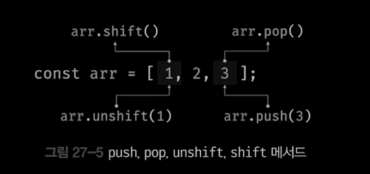
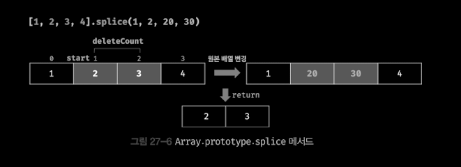
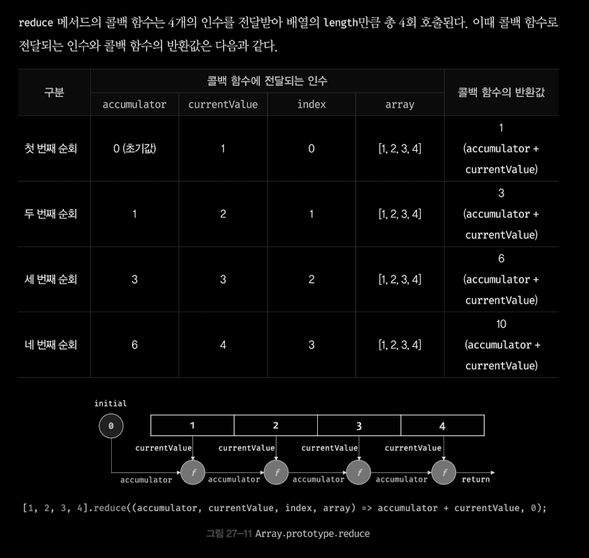

# Ch.27 배열

## 27.1 배열이란?

- 배열은 여러 개의 값을 순차적으로 나열한 자료구조다.
- 배열 리터럴을 통해 생성한 예제

```jsx
const arr = ["apple", "banana", "orange"];
```

- 배열이 가지고 있는 값을 요소라고 부른다. 자바스크립트의 모든 값은 배열의 요소가 될 수 있다.
- 배열의 요소는 배열에서 자신의 위치를 나타내는 0 이상의 정수인 index를 갖는다.
- 배열의 요소의 개수, 즉 배열의 길이를 나타내는 legnth 프로퍼티를 갖는다.
- 배열은 index와 length 프로퍼티를 갖기 때문에 for 문과 같은 반복문을 통해 순차적으로 요소에 접근할 수 있다.
- 자바스크립트에서 배열이라는 타입은 존재하지 않는다. 배열은 객체 타입이다.
- 배열은 배열 리터럴, Array 생성자 함수, Array.of, Array.from 메서드로 생성할 수 있다. 배열의 생성자 함수는 Array 이며 배열의 프로토타입 객체는 Array.prototype이다.
- Array.porotype은 배열을 위한 빌트인 메서드를 제공한다.

```jsx
const arr = [1, 2, 3];
arr.constructor === Array; // true
Object.getPrototypeOf(arr) === Array.prototype; // true
```

- 배열은 객체지만 일반 객체와는 구별되는 독특한 특징이 있다.
  | 구분 | 객체 | 배열|
  | ---------------------------------------------------------- | ----------------------------------------|----------------------------- |
  | 구조 | 프로퍼티 키와 프로퍼티 값 | 인덱스와 요소 |
  | 값의 참조 | 프로퍼티 키 | 인덱스 |
  | 값의 순서 | X | O |
  | length 프로퍼티 | X | O |

```jsx
const arr = [1, 2, 3];
//반복문으로 자료 구조를 순서대로 순회하기 위해서는 자료구조의 요소에 순서대로 접근할 수 있어야 하며
// 자료구조와 길이를 알 수 있어야 한다.
for (let i = 0; i < arr.length; i++) {
	console.log(arr[i]);
}
```

- 배열의 장점은 처음부터 순차적으로 요소에 접근할 수도 있고, 마지막부터 역순으로 요소에 접근할 수도 있으며, 특정 위치부터 순차적으로 요소에 접근할 수도 있다는 것이다. 이는 배열이 인덱슽, 즉 값의 순서와 length 프로퍼티를 갖기 때문에 가능한 것이다.

## 27.2 자바스크립트 배열은 배열이 아니다.

- 자료구조에서 말하는 배열은 동일한 크기의 메모리 공간이 빈틈없이 연속적으로 나열된 자료구조를 말한다.
- 자바스크립트의 배열은 배열의 요소를 위한 각각의 메모리 공간은 동일한 크기를 갖지 않아도 되며, 연속으로 이어져 있지 않을 수도 있다. 이렇게 배열의 요소가 연속적으로 이어져 있지 않는 배열을 희소 배열이라 한다.
- 자바스크립트의 배열은 일반적인 배열의 동작을 흉내 낸 특수한 객체다.

```jsx
console.log(Object.getOwnPropertyDescriptors([1, 2, 3]));
// {
//     "0": {
//         "value": 1,
//         "writable": true,
//         "enumerable": true,
//         "configurable": true
//     },
//   ...
//     "length": {
//         "value": 3,
//         "writable": true,
//         "enumerable": false,
//         "configurable": false
//     }
// }
```

- 자바스크립트 배열은 인덱스를 나타내는 문자열을 프로퍼티 키로 가지며, length 프로퍼티를 갖는 특수한 객체다. 자바스크립트 배열의 요소는 사실 프로퍼티 값이다. 자바스크립트에서 사용할 수 있는 모든 값은 객체의 프로퍼티 값이 될 수 있으므로 어떤 타입의 값이라도 배열의 요소가 될 수 있다.

- 일반적으로 배열은 인덱스로 요소에 빠르게 접근할 수 있다. 하지만 요소를 삽입 또는 삭제하는 경우에는 효율적이지 않다.
- 자바스크립트 배열은 해시 테이블로 구성된 객체이므로 인덱스로 요소에 접근하는 경우 일반적인 배열보다 성능적인 면에서 느릴 수밖에 없는 구조적인 단점이 있다. 하지만 요소를 삽입 도는 삭제하는 경우 일반적인 배열보다 빠른 성능을 기대할 수 있다.

즉, 자바스크립트 배열은 인덱스로 배열 요소에 접근하는 경우에는 일반적인 배열보다 느리지만 요소를 삽입 또는 삭제하는 경우에는 일반적인 배열보다 빠르다.

## 27.3 length 프로퍼티와 희소 배열

- length 프로퍼티는 요소의 개수, 즉 배열의 길이를 나타내는 0 이상의 정수를 값으로 갖는다. length 프로퍼티의 값은 빈 배열일 경우 0이며, 빈 배열이 아닐 경우 가장 큰 인덱스에 1을 더한 것과 같다.

```jsx
[].length[(1, 2, 3)] / length; // 0 // 3
```

- length 프로퍼티의 값은 배열에 요소를 추가하거나 삭제하면 자동 갱신된다.
- length 프로퍼티 값은 요소의 개수, 즉 배열의 길이를 바탕으로 결정되지마 임의의 숫자 값을 명시적으로 할당할 수도 있다.

```jsx
const arr = [1, 2, 3, 4, 5];
// 현재 length 프로퍼티 값인 5보다 작은 숫자 값 3을 length 프로퍼티에 할당
arr.length = 3;
// 배열의 기리가 5에서 3으로 줄어든다.
console.log(arr); // [1,2,3]
```

- 다만 현재 length 프로퍼티 값보다 큰 숫자 값을 할당하는 경우다. 이때 length 프로퍼티 값은 변경되지만 실제로 배열의 길이가 늘어나지는 않는다.
- 현재 length 프로퍼티 값보다 큰 숫자 값을 length 프로퍼티에 할당하는 경우 length 프로퍼티 값은 성공적으로 변경되지만 실제 배열에는 아무런 변함이 없다. 값 없이 비어 있는 요소를 위해 메모리 공간을 확보하지 않으며 빈 요소를 생성하지도 않는다.
- 이처럼 배열의 요소가 연속적으로 위치하지 않고 일부가 비어 있는 배열을 희소 배열이라 한다. 자바스크립트는 희소 배열을 문법적으로 허용한다.

## 27.4 배열 생성

### 27.4.1 배열 리터럴

- 배열 리터럴은 객체 리터럴과 달리 프로퍼티 키가 없고 값만 존재한다.

```jsx
const arr = [1, 2, 3];
console.log(arr.length);
```

### 27.4.2 Array 생성자 함수

- Object 생성자 함수를 통해 객체를 생성할 수 있듯이 Array 생성자 함수를 통해 배열을 생성할 수도 있다.

```jsx
const arr = new Array(10);
console.log(arr); // [empty * 10]
console.log(arr.length); // 10

new Array(1, 2, 3); // [1,2,3]
```

### 27.4.3 Array.of

- 전달된 인수를 요소로 갖는 배열을 생성한다.
- Array 생성자 함수와 다르게 전달된 인수가 1개이고 숫자이더라도 인수를 요소로 갖는 배열을 생성한다.

```jsx
Array.of(1); // [1]
Array.of(1, 2, 3); // [1,2,3];
Array.of("string"); // ["string"]
```

### Array.from

- 유사 배열 객체 또는 이터러블 객체를 인수로 전달받아 배열로 변환하여 반환한다.

```js
// 유사 배열 객체를 변환하여 배열을 생성한다.
Array.from({ length: 2, 0: "a", 1: "b" }); // ["a", "b"]

// 이터러블을 변환하여 배열을 생성한다. 문자열은 이터러블이다.
Array.from("hello"); // ["h", "e", "l","l","o"]
```

- Array.from을 사용하면 두 번째 인수로 전달한 콜백 함수를 통해 값을 만들면서 요소를 채울 수 있다. Array.from 메서드는 두 번째 인수로 전달한 콜백 함수에 첫 번째 인수에 의해 생성된 배열의 요소값과 인덱스를 순차적으로 전달하면서 호출하고, 콜백 함수의 반환값으로 구성된 배열을 반환한다.

```js
// Array.from에 length만 존재하는 유사 배열 객체를 전달하면 undefined를 요소로 채운다.
Array.from({ length: 3 }); // [undefined,undefined,undefined]
// Array.from은 두 번째 인수로 전달한 콜백 함수의 반환값으로 구성된 배열을 반환한다.
Array.from({ length: 3 }, (_, i) => i); // [0,1,2]
```

#### 유사 배열 객체와 이터러블 객체

- 유사 배열 객체(array-like object)는 마치 배열처럼 인덱스로 프로퍼티 값에 접근할 수 있고 length 프로퍼티를 갖는 객체를 말한다. 유사 배열 객체는 마치 배열처럼 for 문으로 순회할 수 도 있다.

```js
// 유사 배열 객체
const arrayLike = {
	0: "applie",
	1: "banana",
	2: "orange",
	length: 3,
};
// 유사 배열 객체는 마치 배열처럼 for 문으로 순회할 수도 있다.
for (let i = 0; i < arrayLike.length; i++) {
	console.log(arrayLike[i]); // apple banana orange
}
```

- 이터러블 객체(iterable object)는 Symbol.iterator 메서드를 구현하여 for ... of 문으로 순회할 수 있으며, 스프레드 문법과 배열 디스트럭처링 할당의 대상으로 사용할 수 있는 객체를 말한다. ES6에서 제공하는 빌트인 이터러블은 Array, String, Map, Set, DOM 컬렉션, arguments 등이 있다.

## 27.5 배열 요소의 참조

- 배열의 요소를 참조할 때에는 대괄호([]) 표기법을 사용한다. 대괄호 안에는 인덱스가 와야 한다.
- 인덱스는 객체의 프로퍼티 키와 같은 역할

## 27.6 배열 요소의 추가와 갱신

```jsx
const arr = [0];
arr[1] = 1;
arr; // [0, 1]
```

## 27.7 배열 요소의 삭제

- 배열은 사실 객체이기 때문에 배열의 특정 요소를 삭제하기 위해 delete 연산자를 사용할 수도 있다.

```jsx
const arr = [1, 2, 3];

// 배열 요소의 삭제
delete arr[1];
arr; // [1, empty, 3]
// length 프로퍼티에 영향을 주지 않는다. 즉, 희소 배열이 된다.
arr.length; // 3
```

- 희소 배열을 만들지 않으면서 배열의 특정 요소를 완전히 삭제하려면 `Array.prototype.splice` 메서드를 사용해야 한다.

```jsx
const arr = [1, 2, 3];
// Array.prototype.splice (삭제를 시작할 인덱스, 삭제할 요소 수)
// arr[1]로부터 1개의 요소를 제거
arr.splice(1, 1);
arr; // [1, 3]
// length 프로퍼티가 자동 갱신된다.
arr.length; // 2
```

## 27.8 배열 메서드

- 배열 객체의 프로토타입인 Array.prototype은 다양한 프로토타입 메서드를 제공한다.
- 원본을 변경하는 메서드 / 원본 배열을 유지하고 새로운 배열을 생성하는 메서드가 있다.
- 가급적 원본 배열을 직접 변경하지 않는 메서드를 사용하는 편이 좋다.

### Array.isArray

```jsx
Array.isArray([1,2]); // true
Array.isArray({1,2}); // false
```

### Array.prototype.indexOf

- indexOf 메서드는 원본 배열에서 인수로 전달된 요소를 검색하여 인덱스를 반환한다.
- 같은 요소가 여러개 있다면 첫 번째로 검색된 요소의 인덱스 반환
- 원본 배열에 인수로 전달한 요소가 존재하지 않으면 -1을 반환한다.

```js
const arr = [1, 2, 2, 3];
// 배열 arr 에서 요소 2를 검색하여 첫 번째로 검색된 요소를 반환
arr.indexOf(2); // 1
arr.indexOf(4); // -1
// 두 번째 인수는 검색을 시작할 인덱스다. 두 번째 인수를 생략하면 처음부터 검색한다.
arr.indexOf(2, 2); // 2
```

- indexOf 메서드는 배열에 특정 요소가 존재하는지 확인할 때 유용하다.

```jsx
const foods = ["apple", "banana", "orange"];
// foods 배열에 orange 요소가 존재하는지 확인
if (foods.indexOf("orange") === -1) {
	// foods 배열에 orange 요소가 존재하지 않으면 추가
	foods.push("orange");
}
```

- indexOf 메서드 대신 ES7부터 도입된 Array.prototype.includes 메서드를 사용하면 가독성이 더 좋다.

```jsx
const foods = ["apple", "banana", "orange"];
if(!foods.includes("orange") {
  foods.push("orange")
})
```

### Array.prototype.push

```js
const arr = [1, 2];
// 인수로 전달받은 모든 값을 원본 배열 arr의 마지막 요소로 추가하고 변경된 length 값을 반환한다.
let result = arr.push(3, 4);
result; // 4
//push 메서드는 원본 배열을 직접 변경한다.
arr; // [1,2,3,4]
```

- push 메서드는 성능 면에서 좋지 않다. 마지막 요소로 추가할 요소가 하나 뿐이라면 push 메서드를 사용하지 않고 length 프로퍼티를 사용하여 배열의 마지막에 요소를 직접 추가할 수 있다. 이 방법이 더 빠르다.

```js
const arr = [1, 2];
arr[arr.length] = 3;
arr; // [1,2,3]
```

- push 메서드는 원본 배열을 직접 변경하는 부수 효과가 있다. 따라서 push 메서드보다는 ES6의 스프레드 문법을 상용하는 편이 좋다.

```js
const arr = [1, 2];
//ES6 스프레드 문법
const newArr = [...arr, 3];
newArr; // [1,2,3]
```

### Array.prototype.pop

- pop 메서드는 원본 배열에서 마지막 요소를 제거하고 제거한 요소를 반환한다.
- 빈 배열이면 undefined 반환
- 원본 배열을 직접 변경한다.

```js
const arr = [1, 2];
// 원본 배열에서 마지막 요소를 제거하고 제거한 요소를 반환한다.
let result = arr.pop();
result; // 2
arr; // [1]
```

- 일반적으로 스택에 데이터를 밀어 넣는 것을 push 라하고 스택에서 데이터를 꺼내는 것을 pop 이라고 한다.

### Array.proototype.unshift

- unshift 메서드는 인수로 전달받은 모든 값을 원본 배열의 선두에 요소로 추가하고 변경된 length 프로퍼티 값을 반환한다.
- 원본 배열을 직접 변경

```js
const arr = [1, 2];
let result = arr.unshift(3, 4);
result; //4
arr; // [3, 4, 1, 2]
```

- unshift 메서드는 원본 배열을 직접 변경하는 부수효과가 있으므로 ES6의 스프레드 문법을 사용하는 편이 좋다.

```js
const arr = [1, 2];

// ES6 스프레드 문법
const newArr = [3, ...arr];
newArr; // [3,1,2]
```

### 27.8.6 Array.prototype.shift

- shift 메서드는 원본 배열에서 첫 번째 요소를 제거하고 제거한 요소를 반환한다.
- 빈 배열이면 undefined 반환
- shift 메서드는 원본 배열을 직접 변경한다.

```js
const arr = [1, 2];
let result = arr.shift();
result; // 1
arr; // [2]
```



### 27.8.7 Array.prototype.concat

- concat 메서드는 인수로 전달된 값들(배열 또는 원시값)을 원본 배열의 마지막 요소로 추가한 새로운 배열을 반환한다.
- 인수로 전달한 값이 배열인 경우 배열을 해체하여 새로운 배열의 요소로 추가한다.
- 원본 배열은 변경되지 않는다.

```js
const arr1 = [1, 2];
const arr2 = [3, 4];

let result = arr1.concat(arr2);
result; // [1,2,3,4]

result = arr1.concat(3);
result; // [1,2,3]

// 배열 arr2와 숫자를 원본 배열 arr1의 마지막 요소로 추가한 새로운 배열을 반환한다.
result = arr1.concat(arr2, 5);
result; // [1,2,3,4,5]

// 원본 배열은 변경하지 않는다.
arr1; // [1,2]
```

- push와 unshift 메서드는 원본 배열을 직접 변경하지만 concat 메서드는 원본 배열을 직접 변경하지 않고 새로운 배열을 반환한다.
- 따라서 push와 unshift 메서드를 사용할 경우 원본 배열을 반드시 변수에 저장해 두어야 하며
- concat 메서드를 사용할 경우 반환값을 반드시 변수에 할당받아야 한다.

- concat 메서드는 ES6의 스프레드 문법으로 대체 가능하다.

```js
let result = [1, 2].concat([3, 4]);
result = [...[1, 2], ...[3, 4]];
```

**- 결론적으로 ES6의 스프레드 문법을 일관성있게 사용하는 것을 권장한다.**

### Array.prototype.splice

- 원본 배열의 중간에 요소를 추가하거나 중간에 있는 요소를 제거하는 경우 splice 메서드를 사용한다.
- splice 메서드는 3개의 매개변수가 있으며 원본 배열을 직접 변경한다.

```js
const arr [1,2,3,4];
// 원본 배열의 인덱스 1부터 2개의 요소를 제거하고 그 자리에 새로운 요소 20, 30을 삽입한다.
const result = arr.splice(1,2,20,30);
// 제거한 요소가 배열로 반환
result // [2,3]
// splice 메서드는 원본 배열을 직접 변경한다.
arr // [1,20,30,4]
```



- splice 메서드의 두 번째 인수, 즉 제거할 요소의 개수를 0으로 지정하면 아무런 요소도 제거하지 않고 새로운 요소들을 삽입한다.
- splice 메서드의 세 버째 인수, 즉 제거한 위치에 추가할 요소들의 목록을 전달하지 않으면 원본 배열에서 지정된 요소를 제거하기만 한다.

```js
const arr = [1, 2, 3, 4];
// 원본 배열의 인덱스 1부터 모든 요소를 제거한다.
const result = arr.splice(1);
arr; // [1]
result; // [2,3,4];
```

- 배열에서 특정 요소를 제거하려면 indexOf 메서드를 통해 특정 요소의 인덱스를 취득한 다음 splice 메서드를 사용한다.

```js
const arr = [1, 2, 3, 1, 2];
// 배열 array에서 item 요소를 제거한다. item 요소가 여러 개 존재하면 첫 번째 요소만 제거한다.
function remove(array, item) {
	const index = array.indexOf(item);
	if (item !== -1) array.splice(index, 1);
	return array;
}
remove(arr, 2); // [1,3,1,2]
```

- filter 메서드를 사용하여 특정 요소를 모두 제거할 수도 있다. (중복된 요소 모두 제거)

```jsx
const arr = [1, 2, 3, 1, 2];

function removeAll(array, item) {
	return array.filter((v) => v !== item);
}
removeAll(arr, 2); // [1,3,1]
```

### Array.prototype.slice

- slice 메서드는 인수로 전달된 범위와 요소들을 복사하여 배열로 반환한다.
- 원본 배열은 변경되지 않는다.
- 두 개의 매개변수를 갖는다.
  - start : 복사를 시작할 인덱스 음수인 경우 배열의 끝에서 인덱스를 나타낸다.
    ex) slice(-2) 는 배열의 마지막 두개의 요소를 복사하여 배열로 반환
  - end : 복사를 종료할 인덱스, 생략시 기본값은 length 프로퍼티 값이다.

```jsx
const arr = [1, 2, 3];

arr.slice(0, 1); // [1];
arr.slice(1); // [2,3]
arr.slice(-1); //[3]
arr.slice(-2); // [2,3]
// 인수를 모두 생략하면 원 본 배열을 그대로 복사한다. (얕은 복사)
arr.slice(); // [1,2,3]
```

> **얕은 복사와 깊은 복사**
> 얕은 복사는 한 단계까지만 복사하는 것을 말하고 깊은 복사는 객체에 중첩되어 있는 객체까지 모두 복사하는 것을 말한다.
> slice, spread 문법, Object.assign 메서드는 모두 얕은 복사를 수행한다. 깊은 복사를 위해서는 Lodash 라이브러리의 cloneDeep 메서드를 사용하는 것을 추천한다.

### Array.prototype.join

- join 메서드는 원본 배열의 모든 요소를 문자열로 변환한 후, 인수로 전달받은 문자열, 즉 구분자(separator)로 연결한 문자열을 반환한다.
- 구분자는 생략 가능하며 기본 구분자는 콤마(,)다.

```js
const arr = [1, 2, 3, 4];
arr.join(); // "1,2,3,4"
arr.join(""); // "1234"
arr.join(":"); // "1:2:3:4"
```

### Array.prototype.revese

- revere 메서드는 원본 배열의 순서를 반대로 뒤집는다. 이때 원본 배열이 변경된다.

```js
const arr = [1, 2, 3];
const result = arr.reverse();
arr; // [3,2,1];
result; // [3,2,1]
```

### Array.prototype.fill

- fill 메서드는 인수로 전달받은 값을 배열의 처음부터 끝까지 요소로 채운다.
- 원본 배열 변경

```jsx
const arr = [1, 2, 3];
arr.fill(0);
arr; // [0,0,0]
```

- 두 번째 인수로 요소 채우기를 시작할 인덱스를 전달할 수 있다.

```jsx
const arr = [1, 2, 3];
arr.fill(0, 1);
arr; // [1,0,0];
```

- 세 번째 인수로 요소 채우기를 멈출 인덱스를 전달할 수 있다. (해당 인덱스 미포함)

```js
const arr = [1, 2, 3, 4, 5];
arr.fill(0, 1, 3);
arr; // [1,0,0,4,5]
```

- fill 메서드를 사용하면 배열을 생성하면서 특정 값으로 요소를 채울 수 있다.

```js
const arr = new Array(3);
arr; // [empty * 3]

const result = arr.fill(1);
arr; // [1,1,1]
```

- fill 메서드로 요소를 채울 경우 모든 요소를 하나의 값만으로 채울 수밖에 없다는 단점이 있다. 하지만 Array.from 메서드를 사용하면 두 번째 인수로 전달한 콜백 함수를 통해 요소값을 만들면서 배열을 채울 수 있다. Array.from 메서드는 두 번째 인수로 전달한 콜백 함수에 첫 번째 인수에 의해 생성된 배열의 요소값과 인덱스를 순차적으로 전달하면서 호출하고, 콜백 함수의 반환값으로 구성된 배열을 반환한다.

```js
const sequences = (length = 0) => Array.from({ length }, (_, i) => i);
sequeces(3); // [0,1,2];
```

### Array.prototype.includes

- 배열내에 특정 요소가 포함되어 있는지 확인하여 true 도는 false를 반환
- 두 번째 인수로 검색을 시작할 인덱스를 전달, 기본값은 0
- 두 번째 인수에 음수를 전달하면 length + index 로 검색 시작 인덱스를 설정

- indexOf 메서드 로도 요소가 포함되어 있는지 확인할 수 있지만 반환값이 -1 인지 확인해줘야하고 배열에 NaN이 포함되어 있는지 확인할 수 없음

```js
[NaN].indexOf(NaN) !== -1; // false
[NaN].includes(NaN); // true
```

### Array.prototype.flat

- 인수로 전달받은 깊이만큼 재귀적으로 배열을 평탄화한다.
- 인수의 기본값은 1이다.
- infinity 로 전달하면 중첩 배열 모두를 평탄화한다.

```jsx
[1, [2, 3, 4, 5]].flat(); // [1,2,3,4,5]
[1, [2, [3, [4]]]].flat(2); // [1,2,3,[4]]
[(1, [2, [3, [4]]])].flat().flat(); // [1,2,3,[4]]
[1, [2, [3, [4]]]].flat(infinity); // [1,2,3,4]
```

## 27.9 배열 고차 함수

- 고차 함수는 함수를 인수로 전달받거나 함수를 반환하는 함수를 말한다.
- 고차 함수는 외부 상태의 변경이나 가변 데이터를 피하고 불변성을 지향하는 함수형 프로그래밍에 기반을 두고 있다.
- 함수형 프로그래밍은 순수 함수와 보조 함수의 조합을 통해 로직 내에 존재하는 조건문과 반복문을 제거하여 복잡성을 해결하고 변수의 사용을 억제하여 상태 변경을 피하려는 프로그래밍 패러다임이다.
- 조건문이나 반복문은 로직의 흐름을 이해하기 어렵게 하고 가독성을 해친다. / 변수는 언제든 변경될 여지가 있어 오류 발생의 원인이 될 수 있다.
- 함수형 프로그래밍은 결국 순수 함수를 통해 부수 효과를 최대한 억제하여 오류를 피하고 프로그래밍의 안전성을 높이려는 노력의 일환이다.

### Array.prototype.sort

- sort 메서드는 배열의 요소를 정렬한다. 원본 배열을 직접 변경하며 정렬된 배열을 반환한다.
- 기본값은 오름차순이다.

```js
const fruits = ["Banana", "Orange", "Apple"];

// 오름차순 정렬
fruits.sort();

// sort 메서드는 원본 배열을 직접 변경한다.
console.log(fruits); // ["Apple", "Banana", "Orange"]
```

- 문자열 요소로 이루어진 배열과 달리 숫자 요소로 이루어진 배열을 정렬할 때는 예외가 발생한다.

```js
const points = [40, 100, 1, 5, 2, 25, 10];

points.sort(); // [1, 10, 100, 2, 25, 40, 5]

// 숫자 요소들로 이루어진 배열은 의도한 대로 정렬되지 않는다.
```

- sort 메서드의 기본 정렬 순서는 유니코드의 순서를 따른다.

- 따라서 숫자 요소를 정렬할 때는 sort 메서드에 정렬 순서를 정의하는 비교 함수를 인수로 전달해야 한다.

```js
const points = [40, 100, 1, 5, 2, 25, 10];
// 숫자 배열의 오름차순 정렬, 비교 함수의 반환값이 0보다 작으면 a를 우선하여 정렬한다.
points.sort((a, b) => a - b); // [1, 2, 5 ~ , 100]
```

- 객체를 요소로 갖는 배열을 정렬하는 예제는 다음과 같다.

```jsx
// 비교 함수, 매개변수 key는 프로퍼티 키다.
function compare(key) {
	// 프로퍼티 값이 문자열인 경우 - 산술 연산으로 비교하면 NaN이 나오므로 비교 연산을 사용한다.
	// 비교 함수는 양수/음수/0을 반환하면 되므로 - 산술 연산 대신 비교 연산을 사용할 수 있다.
	return (a, b) => (a[key] > b[key] ? 1 : a[key] < b[key] ? -1 : 0);
}
```

### Array.prototype.forEach

- forEach 메서드는 for 문을 대체할 수 있는 고차 함수다. forEach 메서드는 자신의 내부에서 반복문을 실행한다.
- 즉, forEach 메서드는 반복문을 추상화한 고차함수다.
- 내부에서 반복문을 통해 자신을 호출한 배열을 순회하면서 수행해야 할 처리를 콜백 함수로 전달받아 반복 호출한다.

```js
const numbers = [1, 2, 3];
const pows = [];
// forEach 메서드는 numbers 배열의 모든 요소를 순회하면서 콜백 함수를 반복 호출한다.
numbers.forEach((item) => pows.push(item ** 2));
pows; // [1,4,9]
```

- forEach 메서드의 콜백 함수는 forEach 메서드를 호출한 배열의 요소값고 인덱스, forEach 메서드를 호출한 배열 자체
- 즉, this를 순차적으로 전달받을 수 있다.

```jsx
// forEach 메서드는 콜백 함수를 호출하면서 3개(요소값, 인덱스, this)의 인수를 전달한다.
[1, 2, 3].forEach((item, index, arr) => {
	console.log(`요소값:${item}, 인덱스:${index}, this:${JSON.stringify(arr)}`);
});
```

```
요소값:1, 인덱스:0, this:[1,2,3]
요소값:2, 인덱스:1, this:[1,2,3]
요소값:3, 인덱스:2, this:[1,2,3]
```

- JSON.stringify : 객체를 JSON 포맷의 문자열로 변환한다.

- forEach 메서드는 원본 배열(forEach 메서드를 호출한 배열, 즉 this)를 변경하지 않는다.
- 하지만 콜백 함수를 통해 원본 배열을 변경할 수는 있다.

```jsx
const numbers = [1, 2, 3];

// forEach 메서드는 원본 배열을 변경하지 않지만 콜백 함수를 통해 원본 배열을 변경할 수 잇다.
// 콜백 함수의 세 번째 매개변수 arr은 원본 배열 numbers를 가리킨다.
// 따라서 콜백 함수의 세 번째 매개변수 arr을 직접 변경하면 원본 배열 numbers가 변경된다.
numbers.forEach((item, index, arr) => {
	arr[index] = item ** 2;
});
numbers; // [1, 4, 9]
```

- forEach 메서드의 반환값은 언제나 undefined다.

- 화살표 함수는 함수 자체의 this 바인딩을 갖지 않는다. 따라서 화살표 함수 내부에서 this를 참조하면 상위 스코프
- 즉 multiply 메서드 내부의 this를 그대로 참조한다.

```js
class Numbers {
	numberArray = [];
	multiply(arr) {
		arr.forEach((item) => this.numberArray.push(item * item));
	}
}

const numbers = new Numbers();
numbers.multiply([1, 2, 3]);
console.log(numbers.numberArray); // [1, 4, 9]
```

- forEach 메서드는 for 문과는 달리 break, continue 문을 사용할 수 없다. (순회 중간에 탈출 불가)

## Array.prototype.map

- map 메서드는 자신을 호출한 배열의 모든 요소를 순회하면서 인수로 전달받은 콜백 함수를 반복 호출한다.
- 콜백 함수의 반환값들로 구성된 새로운 배열을 반환한다.
- 원본 배열은 변경하지 않는다.

```js
const numbers = [1, 4, 9];
// map 메서드는 numbers 배열의 모든 요소를 순회하면서 콜백 함수를 반복 호출한다.
// 그리고 콜백 함수의 반환값들로 구성된 새로운 배열을 반환한다.
const roots = numbers.map((item) => Math.sqrt(item));
// 이렇게 쓸수도 있다. const roots = numbers.map(Math.sqrt);
roots; // [1,2,3]
numbers; // [1,4,9]
```

- forEach 메서드와 map 메서드의 공통점은 자신을 호출한 배열의 모든 요소를 순회하고
- 인수로 전달 받은 콜백 함수를 반복 호출한다는 것이다.
- forEach 메서드는 언제나 undefined를 반환하고
- map 메서드는 콜백 함수의 반환값들로 구성된 새로운 배열을 반환하는 차이가 있다.
- 즉, forEach는 단순히 반복문을 대체하기 위한 고차 함수
- map 메서드는 요소값을 다른 값으로 mapping 한 새로운 배열을 생성하기 위한 고차함수다.

- map 메서드가 생성하면 반환하는 새로운 배열의 length 프로퍼티 값은 map 메서드를 호출한 배열의 length 프로퍼티 값과 반드시 일치한다.

```js
// map 메서드는 콜백 함수를 호출하면서 3개(요소값, 인덱스, this)의 인수를 전달한다.
[1, 2, 3].map((item, index, arr) => {
	console.log(`요소값:${item}, 인덱스:${index}, this:${JSON.stringify(arr)}`);
	return item;
});
```

- forEach 메서드와 마찬가지로 map 메서드의 두 번째 인수로 map 메서드의 콜백 함수 내부에서 this로 사용할 객체를 전달할 수 있다.

```js
class Prefixer {
	constructor(prefix) {
		this.prefix = prefix;
	}
	add(arr) {
		return arr.map(function (item) {
			// 외부에서 this를 전달하지 않으면 this는 undefined를 가리킨다.
			return this.prefix + item;
		}, this); // map 메서드이ㅡ 콜백 함수 내부에서 this로 사용할 객체를 전달
	}
}
const prefixer = new Prefixer("-webkit-");
prefixer.add(["transition", "user-select"]);
// ['-webkit-transition', '-webkit-user-select']
```

- 더 나은 방법은 ES6의 화살표 함수를 사용하는 것이다.
- 화살표 함수는 함수 자체의 this 바인딩을 갖지 않는다.
- 다라서 화살표 함수 내부에서 this를 참조하면 상위 스코프, 즉 add 메서드 내부의 this를 그대로 참조한다.

```jsx
class Prefixer {
	constructor(prefix) {
		this.prefix = prefix;
	}
	add(arr) {
		// 화살표 함수 내부에서 this를 참조하면 상위 스코프의 this를 그대로 참조한다.
		return arr.map((item) => this.prefix + item);
	}
}
const prefixer = new Prefixer("-webkit-");
prefixer.add(["transition", "user-select"]);
// ['-webkit-transition', '-webkit-user-select']
```

### Array.prototype.filter

- filter 메서드는 자신을 호출한 배열의 모든 요소를 순회하면서 인수로 전달받은 콜백 함수를 반복 호출한다.
- 콜백 함수의 반환값이 true인 요소로만 구성된 새로운 배열을 반환한다.

```js
const numbers = [1, 2, 3, 4, 5];
// filter 메서드는 numbers 배열의 모든 요소를 순회하면서 콜백 함수를 반복 호출한다.
// 그리고 콜백 함수의 반환값이 true인 요소로만 구성된 새로운 배열을 반환한다.
// 다음의 경우 numbers 배열에서 홀수인 요소만 필터링한다. (1은 true로 평가된다.)

const odds = numbers.filter((tiem) => item % 2);
odds; // [1, 3, 5]
```

- filter 메서드는 자신을 호출한 배열에서 필터링 조건을 만족하는 특정 요소만 추출하여 새로운 배열을 만들고 싶을 때 사용한다
- filter 메서드는 콜백 함수를 호출할 때 3개의 인수, filter 메서드를 호출한 배열의 요소값, 인덱스, filter 메서드를 호출한 배열(this)를 순차적으로 전달한다.
- filter 메서드의 두 번째 인수로 filter 메서드의 콜백 함수 내부에서 this로 사용할 객체를 전달할 수 있다.
- 화살표 함수를 사용하는 것이 더 나은 방법이다.
- filter 메서드는 자신을 호출한 배열에서 특정 요소를 제거하기 위해 사용할 수도 있다.

```js
class Users {
	constructor() {
		this.users = [
			{ id: 1, name: "Lee" },
			{ id: 2, name: "Kim" },
		];
	}
	// 요소 추출
	findById(id) {
		// id가 일치하는 사용자만 반환한다.
		return this.users.filter((user) => user.id === id);
	}
	// 요소 제거
	remove(id) {
		// id가 일치하지 않는 사용자는 제거한다.
		this.users = this.users.filter((user) => user.id !== id);
	}
}

const users = new Users();

users.findById(2); // [ { id: 2, name: 'Kim' } ]
users.remove(1);
users; // Users {
//   users: [ { id: 2, name: 'Kim' } ],
// }
```

## Array.prototype.reduce

- reduce 메서드는 자신을 호출한 배열의 모든 요소를 순회하면서 인수로 전달받은 콜백 함수를 반복 호출한다.
- 콜백 함수의 반환값을 다음 순회 시에 콜백 함수의 첫 번째 인수로 전달하면서 콜백 함수를 호출하여
- 하나의 결과값을 만들어 반환한다.
- 원본 배열은 변경하지 않는다.

- reduce 메서드는 첫 번째 인수로 콜백 함수, 두 번째 인수로 초기값을 전달받는다.
- reduce 메서드의 콜백 함수에는 4개의 인수, 초기값 또는 콜백 함수의 이전 반환값, reduce 메서드를 호출한 배열의 요소값과 인덱스, reduce 메서드를 호출한 배열(this)가 전달된다.

```js
// 1부터 4까지 누적을 구한다.
const sum = [1, 2, 3, 4].reduce(
	(accumulator, currentValue, index, array) => accumulator + currentValue,
	0
);
console.log(sum); // 10
```



- 이처럼 reduce 메서드는 초기값과 배열의 첫 번째 요소값을 콜백 함수에게 인수로 전달하면서 호출하고
- 다음 순회에는 콜백 함수의 반환값과 두 번째 요소값을 콜백 함수의 인수로 전달하면서 호출한다.
- 이러한 과정을 반복하여 reduce 메서드는 하나의 결과값을 반환한다.

- 예제) 평균 구하기

```js
const values = [1, 2, 3, 4, 5, 6];

const average = values.reduce((acc, cur, i, { length }) => {
	return i === length - 1 ? (acc + cur) / length : acc + cur;
}, 0);
```

- 예제) 최대값 구하기

```js
const values = [1, 2, 3, 4, 5];
const max = values.reduce((acc, cur) => (acc > cur ? acc : cur), 0);
console.log(max);
```

- 최대값을 구할 때는 reduce 메서드보다 Math.max 메서드를 사용하는 방법이 더 직관적이다.

```js
const values = [1, 2, 3, 4, 5];
const max = Math.max(...values);
console.log(max); // 5
```

- 예제) 요소의 중복 횟수 구하기

```js
const fruits = ["banana", "apple", "orange", "orange", "apple"];

const count = fruits.reduce((acc, cur) => {
	// 첫 번째 순회 시 acc는 초기값인 {} 이고 cur은 첫 번째 요소인 "banana"다.
	// 초기값으로 전달받은 빈 객체에 요소값인 cur을 프로퍼티 키로, 요소의 개수를 프로퍼티 값으로 할당한다.
	// 만약 프로퍼티 값이 undefined(처음 등장하는 요소)이면 프로퍼티 값을 1로 초기화한다.
	acc[cur] = (acc[cur] || 0) + 1;
	return acc;
}, {});
// 콜백 함수는 총 5번 호출되고 다음과 같이 결과값을 반환한다.
count; // { banana: 1, apple: 2, orange: 2 }
```

- 예제) 중첩 배열 평탄화

```js
const values = [1, [2, 3], 4, [5, 6]];
const flatten = values.reduce((acc, cur) => acc.concat(cur), []);
flatten; //[ 1, 2, 3, 4, 5, 6 ]
```

- 중ㅇ첩 배열을 평탄화할 때는 Array.prototype.flat 메서드가 더 직관적이다.

**- 예제) 중복 요소 제거**

```js
const values = [1, 2, 3, 4, 5, 6, 7, 7, 8, 8, 9, 9, 9];
const result = values.reduce(
	(unique, val, i, _values) =>
		// 현재 순회 중인 요소의 인덱스 i가 val의 인덱스와 같다면 val은 처음 순회하는 요소다.
		// 현재 순회 중인 요소의 인덱스 i가 val의 인덱스와 다르다면 val은 중복된 요소다.
		// 처음 순회하는 요소만 초기값 [] 가 전달된 unique 배열에 담아 반환하면 중복된 요소는 제거된다.
		_values.indexOf(val) === i ? [...unique, val] : unique,
	[]
);

result; // [ 1, 2, 3, 4, 5, 6, 7, 8, 9 ]
```

- 중복 요소를 제거할 때는 reduce 메서드보다 filter 메서드를 사용하는 방법이 더 직관적이다.

```js
const values = [1, 2, 3, 4, 5, 6, 7, 7, 8, 8, 9, 9, 9];
// 현재 순회 중인 요소의 인덱스 i가 val의 인덱스와 같다면 val은 처음 순회하는 요소다. 이 요소만 필터링 한다.
const result = values.filter((val, i, _values) => _values.indexOf(val) === i);

result; // [ 1, 2, 3, 4, 5, 6, 7, 8, 9 ]
```

- (추천) 또는 중복되지 않는 유일한 값들의 집합인 set 을 사용할 수도 있다.

```js
const values = [1, 2, 3, 4, 5, 6, 7, 7, 8, 8, 9, 9, 9];
const result = [...new Set(values)];
result; // [ 1, 2, 3, 4, 5, 6, 7, 8, 9 ]
```

- 이처럼 map, filter, some, every, find 같은 모든 배열의 고차 함수는 reduce 메서드로 구현할 수 있다.
- 두번째 인수로 전달하는 초기값은 옵션으로 생략할 수 있다.

```js
const sum = [1, 2, 3, 4].reduce((acc, cur) => acc + cur);
sum; // 10
```

- sum 이 빈 배열이라면 초기값을 전달하지 않을 경우 에러가 발생할 수 있으므로 주의해야한다. (항상 초기값을 전달해주자)

- 예제) 객체의 특정 프로퍼티 값을 합산하는 경우

```js
const products = [
	{ id: 1, price: 100 },
	{ id: 2, price: 200 },
	{ id: 3, price: 300 },
];

const priseSum = products.reduce((acc, cur) => acc + cur.price, 0);
// 초기값을 전달해주지 않으면 {id :1 price:100}이 초기값이 되어 2번째 순회시 오류가 발생한다.

priseSum; // 600
```

### Array.prototype.some

- 배열의 요소 중에 콜백 함수를 통해 정의한 조건을 만족하는 요소가 1개 이상 존재하는지 확인하여
- 그 결과를 불리언 타입으로 반환
- some 메서드를 호출한 배열이 빈 배열인 경우 언제나 false 를 반환하므로 주의해야 한다.

```js
[5, 10, 15].some((item) => item > 10); // true
[5, 10, 15].some((item) => item < 0); // false
["apple", "banana", "mango"].some((item) => item === "banana"); // true
```

### Array.prototype.every

- every 메서드는 some과 반대로 콜백 함수의 반환값이 모두 참이면 true, 단 한 번이라도 거짓이면 false를 반환한다.
- 즉, 배열의 모든 요소가 콜백 함수를 통해 정의한 조건을 모두 만족하는지 확인하여 그 결과를 불리언 타입으로 반환한다.

### Array.prototype.find

- 인수로 절단된 콜백 함수를 호출하여 배열의 요소를 순회하면서 반환값이 true인 첫 번째 요소를 반환한다.
- 콜백 함수의 반환값이 true인 요소가 존재하지 않는다면 undefined를 반환한다.

```js
const users = [
	{ id: 1, name: "han" },
	{ id: 2, name: "lee" },
	{ id: 3, name: "kim" },
	{ id: 4, name: "park" },
];

users.find((user) => user.id === 2); // {id:2, name:"lee"}
```

### Array.prototype.findIndex

- 콜백 함수를 호출하여 반환값이 true인 첫 번째 요소의 인덱스를 반환한다.
- 반환값이 true인 요소가 존재하지 않는다면 -1을 반환한다

### Array.prototype.flatMap

- map 메서드를 통해 생성된 새로운 배열을 평탄화한다.
- map 메서드 -> flat 메서드

```js
const arr = ["hello", "world"];
// map과 flat 을 순차적으로 실행
arr.map((x) => x.split("")).flat();
// flatMap은 map을 통해 생성된 새로운 배열을 평탄화한다.
// 단 1단계만 평탄화할 수 있다. 깊이를 지정하기 위해서는 flat 을 따로 호출해야 한다.
arr.flatMap((x) => x.split(""));
// [ 'h', 'e', 'l', 'l', 'o', 'w', 'o', 'r', 'l', 'd' ]
```
