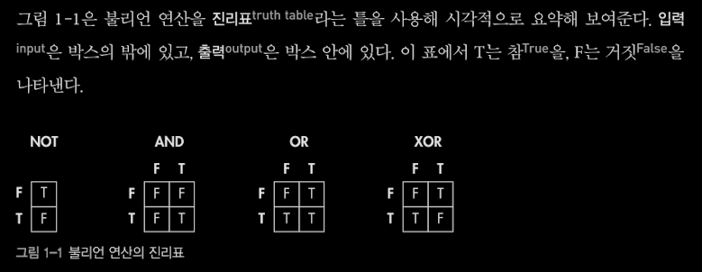
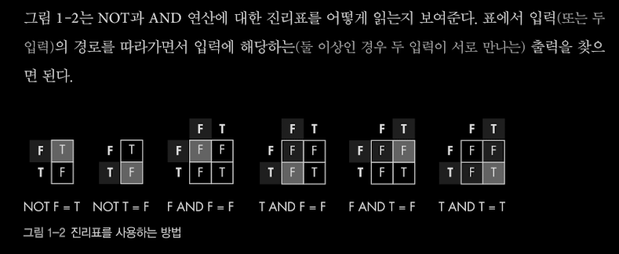
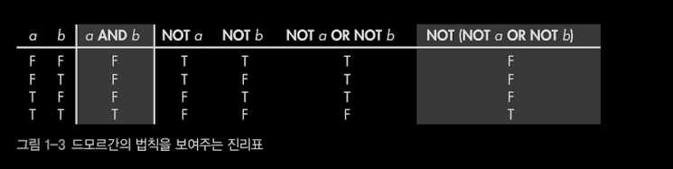

# 1장 컴퓨터 내부의 언어 체계

> ### 컴퓨터는 어떤 말을 사용할까

- 컴퓨터는 사람의 말을 알아듣지 못하므로 컴퓨터에게 명령을 내리기 위해서는 사람이 컴퓨터의 말을 배워야 한다.
- 자연어(사람이 쓰는 언어)와 컴퓨터 언어는 많은 요소를 공유한다.

> ### 언어란 무엇인가

- 언어는 개념 전달을 위한 편의를 제공한다.
- 모든 언어의 뜻은 기호의 집합으로 인코딩`encoding`된다.
- 의므를 기호로 인코딩하는 것만으로는 충분하지 않다. 언어가 제대로 작동하려면 의소소통하는 당사자들이 모두 같은 문맥`context`을 공유해서 같은 기호에 같은 뜻을 부여할 수 있어야 한다.

- 문자 언어의 틀을 이루는 세 가지 구성요소
  - 기호가 들어갈 상자
  - 상자에 들어갈 기호
  - 상자의 순서

> ### 비트

- 자연어에서는 이 상자를 문자`character`라고 부르고 컴퓨터에서는 비트`bit`(2진법을 사용)라고 부른다.
- 프로그래밍 : 비트에 의미 부여하기

> ### 논리연산

- 참 / 거짓
- 다른 비트들이 표현하는 내용으로 새로운 비트를 만들어내는 동작을 논리 연산`logic operation` 이라고 한다.

> > #### 불리언 대수

- 비트에 대해 사용할 수 있는 연산 규칙의 집합
- 불리언 연산자 : NOT, AND, OR
  
  

> > #### 드모르간의 법칙

> > 

> > ### 정수를 비트로 표현하는 방법

> > #### 양의 정수 표현
