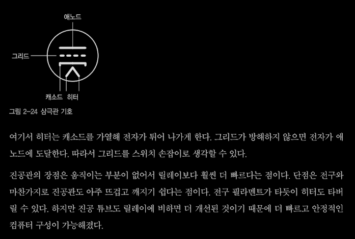
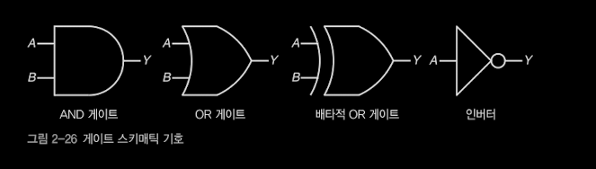
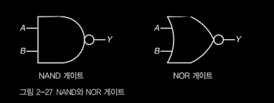

### 아날로그 세계에서 디지털 만들기

### 10진 숫자 대신 비트를 사용하는 이유

- 손가락 대신 비트를 사용하면 효율이 훨씬 더 좋다.

## 간단한 전기 이론 가이드

### 전기는 수도 배관과 유사하다.

- 물이 물탱크에서 나오는 것처럼 전기는 배터리 같은 에너지 근원에서 나온다. 물탱크가 텅 비면 물을 채워 넣어야 하는 것처럼 배터리 에너지가 고갈되면 충전을 해야 한다.
- 한 밸브의 출력이 다른 밸브의 입력에 연결될 경우, 이런 연결을 직렬 연결이라고 한다. AND 연산
- 병렬 연결은 두 밸브의 입력을 한 관에 함께 연결하고 두 밸브의 출력을 다른 관에 함께 연결하면 생기는데, OR 연산을 구현한다.

- 물이 파이프를 흘러서 전달되는 데 시간이 걸리는 것처럼, 전기가 컴퓨터 칩 내부에서 전파되는데도 시간이 걸린다. :: **전파 지연**

- 전기도 선을 통해 이동한다. 다만 이런 전기의 이동은 실제로는 전자의 흐름은 아니고 전자기 에너지 반응이 전파되는 현상을 전기라고 불렀고 이 단어가 정착한 것뿐이다.
- 전기 선은 두 부분으로 구성된다. 금속을 도체 / 금속 바깥쪽을 둘러싼 부분 부도체
- 전기의 흐름을 제어할 수 있는 밸브를 스위치라고 부른다.
- 물은 압력에 의해 밀려서 움직인다. 전기에서 수압에 해당하는 존재는 전압 voltage 이며, 측정 단위는 볼트 volt(V) 다. 전기 흐름의 양은 전류 current(I) 측정 단위는 ampere(A)
- 저항 resistance(R)을 측정할 때는 옴 ohm 을 쓴다.
- 옴의 법칙 I = V/R
- 전기 시스템은 회로 circuit 라고 부르며 스키매틱 schematic diagrams (계통도/회로도)을 통해 문서화한다.

## 비트를 처리하기 위한 하드웨어

### 릴레이

- 전자기를 사용해 모터를 만드는 방법 : 선으로 만든 코일 주변에서 자석을 움직이면 전기가 생긴다. 발전기는 이런 식으로 작동한다.
- 릴레이는 스위치를 움직이기 위해 전자석을 사용하는 장치다.
- 릴레이는 느리고 전기를 많이 소모하며, 먼지(또는 벌레)가 스위치 접점에 있으면 제대로 작동하지 않는다는 큰 문제가 있다. 실제로 미국 컴퓨터 과학자 그레이스 호퍼가 1947년 하버드 마크 2에 발생한 오류를 추적하다가 릴레이에 낀 나방을 발견하면서 버그 bug라는 단어가 유명해졌다.

### 진공관

- 영국 물리학자이자 전기 엔지니어인 존 앰브로즈 플레밍 경이 진공관을 발명했다. 그는 물체를 충분히 가열하면 전자가 튀어나오는 열전자 방출이라는 현상을 기반으로 진공관을 만들었다.
- 진공관 안에서는 야구 투수 같은 역할을 하는 캐소드 cathode 와 캐소드를 가열하는 히터 heater가 있다. 캐소드에서 발생한 전자(야구공)은 진공 속에서 애노드 anode (포스 같은 역할)로 날아간다.
- 전자는 자석과 비슷한 성질을 몇 까지 띠는데, 그중에는 서로 다른 극이 서로를 끌어당기고 서로 같은 극이 서로를 밀어낸다는 성질이 있다.
- 진공관에 추가로 타자 역할을 하는 요소를 더할 수 있는데 이를 그리드 grid라고 한다. 그리드는 캐소드에서 나오는 전자를 쫓아내서 애노드에 도착하지 못하게 만든다.
- 세 요소(캐소드, 그리드, 애노드)가 들어 있는 진공관을 삼극관이라고 부른다.
  

### 트랜지스터

- 전송 저항 transfer resistor 이라는 말을 줄인 트랜지스터 transistor는 진공관과 비슷하지만 반도체 semiconductor 라는 특별한 물질을 사용한다.
- 반도체는 도체와 부도체 사이를 오갈 수 있는 물질이다.
- 트랜지스터가 반도체 물질로 이뤄진 기판 substrate 또는 slab 위에 만들어진다는 점이다.
- 보통 실리콘(규소)이 기판 재료로 쓰인다.
- 쌍극 접합 트랜지스터 BJT / 필드 효과 트랜지스터 FET
- 금속산화물 반도체 전계 효과 트랜지스터 MOSFET 는 전력 소모가 적기 때문에 현대 컴퓨터 칩에서 가장 널리 쓰이고 있다.
- N채널과 p채널 MOSFET 을 서로 보완하도록 한 쌍으로 묶어서 사용하는 경우가 많은데, 이로부터 CMOS라는 말이 나왔다.

### 집적 회로

- 트랜지스터를 사용하면서 더 작고, 빠르고, 신뢰할 수 잇으며 전력도 적게 소모하는 논리 회로를 만들 수 있게 되엇다. 하지만 트랜지스터를 사용하면 AND 함수 같은 간단한 회로를 만들 때조차도 부품이 너무 많이 필요하다.
- 1958년 잭 킬비라는 미국 엔지니어와 로버트 노이스라는 미국 수학자라는 미국 수학자이자 물리학자가 집적 회로 integrated circuit를 발명했다.
- 집적 회로를 사용하면 복잡한 시스템을 트랜지스터 하나를 만드는 정도의 비용으로 만들 수 있다. 집적 회로는 생긴 모양 때문에 칩 chip 이라고 불렀다.

### 논리 게이트

- 논리 게이트는 논리 연산을 수행하는 회로가 미리 들어가 있다.
- 논리 게이트를 사용하면 하드웨어 설계가 밑바닥부터 모든 회로를 설계할 필요 없이, 배관공이 기성 제품들을 복잡한 배관으로 연결해 수도 시스템을 만드는 것처럼 IC를 선으로 연결해 복잡한 회로를 쉽게 만들 수 있다.
  

- 논리 게이트에서 가장 단순한 회로는 NAND (not and) 나 NOR(not or) 이다.
  
- NAN만 있으면 OR, AND,NOT으로 표현할 수 있는 모든 논리는 표현할 수 있다.
- 실제 현실에서 사용 중인 신호 중에는 천천히 변하거나 잡음이 있을 수 있다.
- 이러한 글리치 glitch (작은 오류)는 이력 현상 hysteresis을 사용해 방지할 수 있다.
- 이력 현상이란 말은 판정 기준이 이력(과거에 벌어진 일)에 따라 달라진다는 뜻이다.

### 차동 신호

- 차동(차이나 격차라는 뜻)이라는 이름은 측정하는 값이 서로 반전관계인 신호 쌍의 차이를 측정하기 때문에 붙은 이름

### 전파 지연

- 전파 지연은 입력의 변화가 출력에 영향을 미칠 때까지 걸리는 시간

## 출력 유형

### 토템폴 출력

### 오픈 컬렉터 출력

## 게이트를 조합한 복잡한 회로

- 게이트를 사용하면서 하드우ㅐ어 설계 과정이 아주 단순해졌다. 사람들은 더 이상 개별 부품을 가지고 회로를 설계할 필요가 없다.
- 하드웨어 설계자들은 SSI 게이트를 사용해 자신들이 개별적인 부품을 사용해 설계할 때와 마찬가지로 어떤 것이든 만들 수 있다.
- 그리고 개별 부품을 사용하는 것보다 더 싸고 더 작게 원하는 시스템을 만들 수 잇다.
- 중간 규모 집적 회로 MSI 라고 불리는 부품은 이런 게이트 조합을 제공하기 위해 도입됐다.
- 대규모 집적 회로 LSI / 초대규모 집적 회로 등이 나왔다.

### 가산기

??

### 디코더

- 디코더는 인코딩된 수를 개별 비트의 집합으로 만들어준다.
- 디스플레이를 만드는데 응용할 수 있다.
